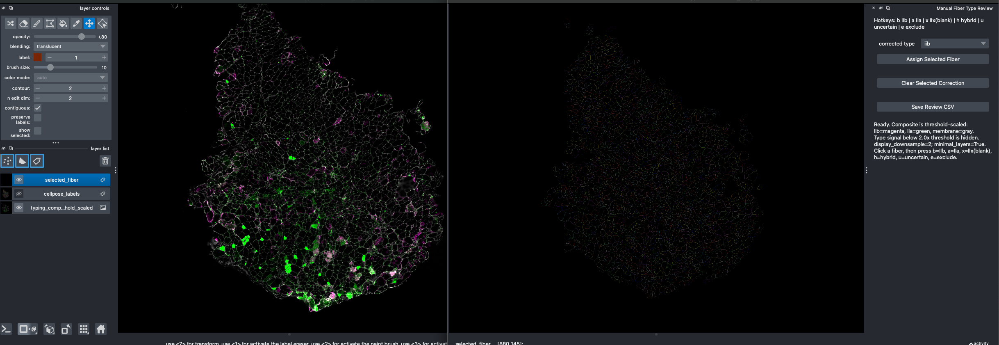
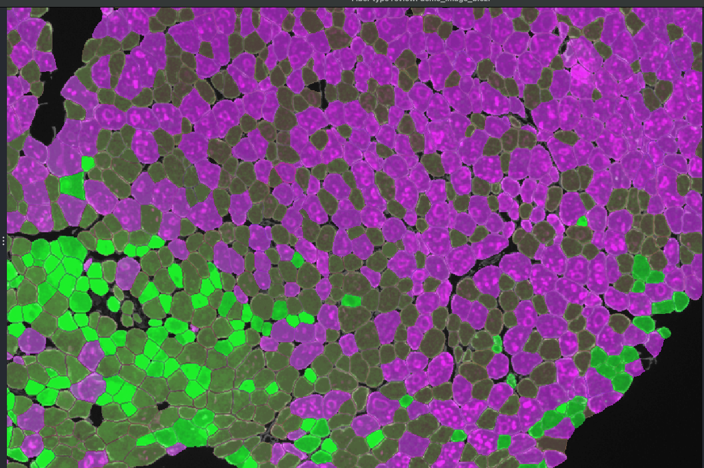
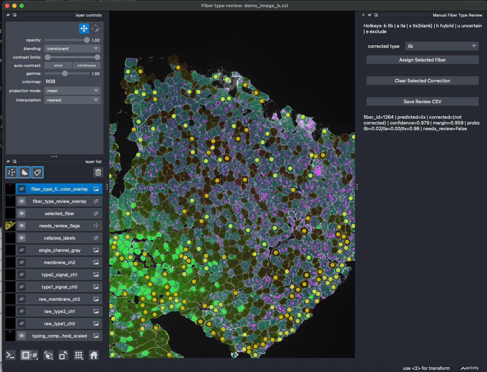
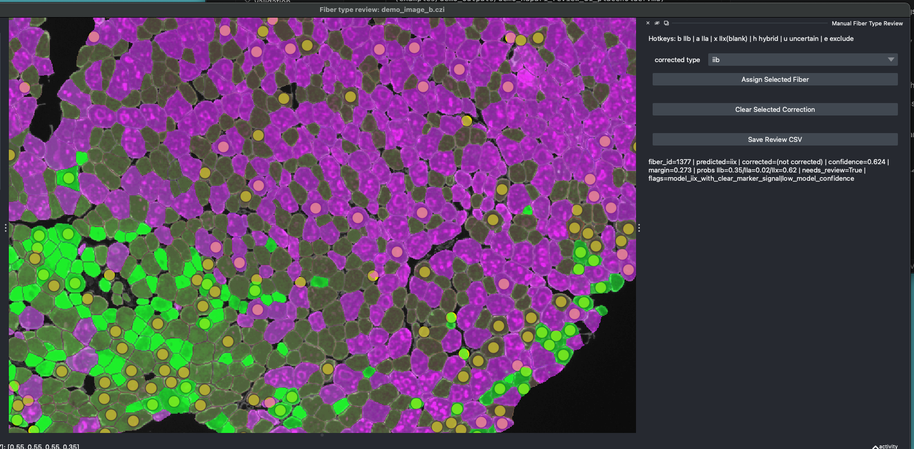
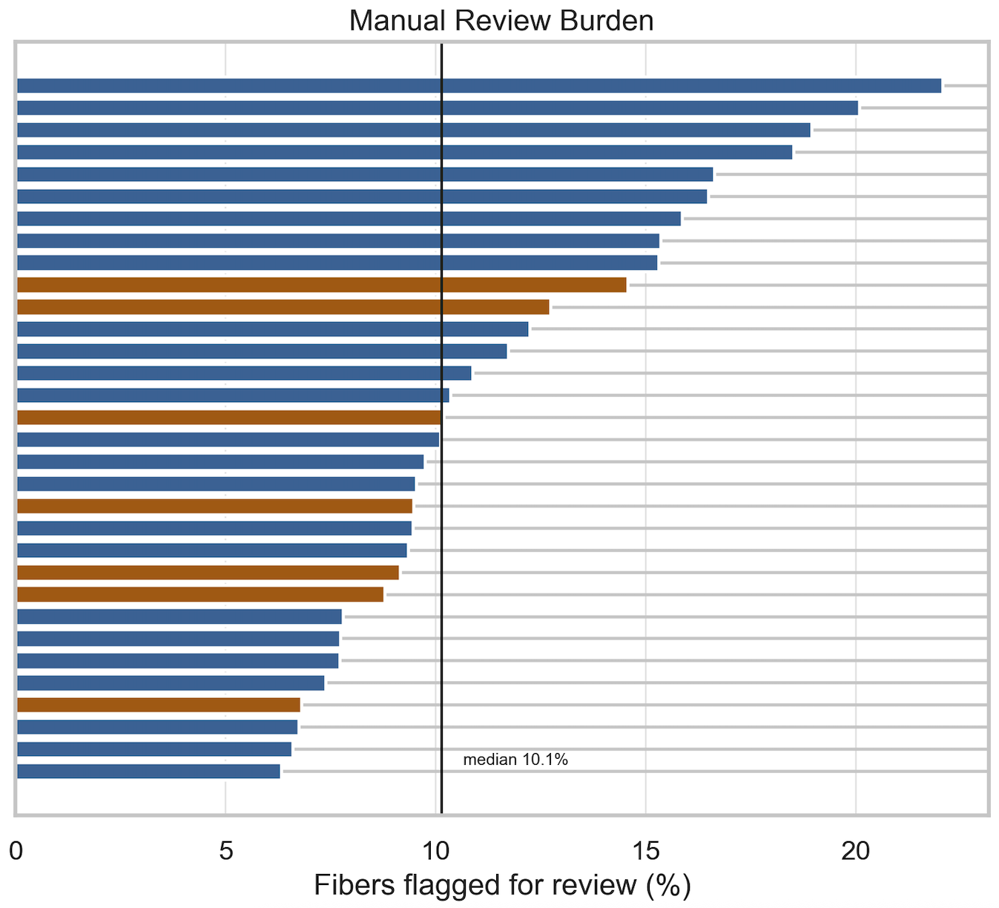

# FiberTypeQC v0.3.0.dev0

**Muscle fiber segmentation, type classification, and interactive review for immunofluorescence histology images.**

This pipeline processes multi-channel immunofluorescence (IF) microscopy images of muscle tissue to:
1. **Segment** muscle fibers from a membrane/border channel (Cellpose)
2. **Classify** fiber types (IIB, IIA, IIX) from marker channels
3. **Extract** quantitative features and statistical summaries
4. **Review** classifications interactively (Napari UI)
5. **Export** validated results to CSV

## Demo

The latest published release is v0.2.0. This development branch is v0.3.0.dev0 and retains the
review-assisted frozen baseline workflow while candidate-model evaluation remains experimental.
FiberTypeQC is not positioned as a final validated MyoSight replacement.

Demo assets:

Segmentation view (raw membrane with labels):



Fiber-type overlay view:



Napari review UI (overview):



Napari review UI (zoomed, confidence/probability context):



Batch/validation summary figure:



The two Napari screenshots intentionally show both full-context review overlay and a zoomed inspection
view for per-fiber confidence/probability interpretation.

Demo CSV outputs and provenance notes are documented in
[docs/demo_manifest.md](docs/demo_manifest.md).

Run the public-safe deterministic reference workflow and validate its outputs:

```bash
uv run python -m scripts.run_reference
```

This reference uses a supplied synthetic label mask so its golden tables do not depend on Cellpose
device behavior. It validates pipeline, frozen-model, QC-summary, review-merge, schema, and digest
mechanics; it is not biological validation.

---

## Quick Start

### 1. Environment Setup

```bash
# Clone/navigate to this repo
cd /path/to/fibertypeqc

# Install dependencies (requires uv)
uv sync

# Or activate existing environment
source .venv/bin/activate
```

For detailed setup instructions, see [README_uv_setup.md](README_uv_setup.md).

### 1.1 Tests

Fast synthetic/default test path:

```bash
uv run python -m pytest -m "not integration"
```

Optional integration path:

```bash
uv run python -m pytest -m integration
```

### 2. Run the Frozen v0 Pipeline

The **v0 frozen command** is the production-validated baseline for consistent results.

```bash
uv run python -m scripts.run_pipeline \
  --input path/to/image.czi \
  --output-dir outputs/v0_run/image_name \
  --iib-channel 0 \
  --iia-channel 1 \
  --membrane-channel 2 \
  --typing-preprocess tile_subtract \
  --typing-tile-size 256 \
  --typing-erode-px 2 \
  --classifier-path data/models/rebaseline_tile_v2_p75p90_iib_iia_iix.joblib
```

**Parameters:**
- `--input`: Path to .czi or .tiff image
- `--output-dir`: Where to save results (creates subdirectory per image)
- `--iib-channel`: Channel for IIb marker signal (default: 0)
- `--iia-channel`: Channel for IIa marker signal (default: 1)
- `--membrane-channel`: Structural membrane/laminin channel for segmentation (default: 2)
- `--classifier-path`: Path to sklearn classifier (.joblib)
- All other parameters use frozen v0 defaults (see `src/run_batch.py` for the full set)

The frozen baseline channel schema is intentionally narrow: IIx is inferred as the unstained class
relative to the IIb and IIa channels. Panel-aware configuration is available as an explicit opt-in,
but does not expand the biological claims made by the frozen default model.
Legacy aliases `--type1-channel` and `--type2-channel` are still accepted for backward
compatibility. See [docs/quickstart.md](docs/quickstart.md), [docs/panel_schema.md](docs/panel_schema.md),
and [data/models/model_card.md](data/models/model_card.md).

Advanced/model-development note:

- `--export-diagnostics` is available for optional feature/model debugging output.
- It is off by default.
- It writes a separate diagnostics CSV and does not expand the stable `*_fibers.csv` schema.

### 3. Batch Processing

Process multiple images in a directory:

```bash
uv run python -m scripts.run_batch \
  --input-dir /path/to/images \
  --output-dir outputs/v0_batch

# Or use default output directory (outputs/v0_batch)
uv run python -m scripts.run_batch --input-dir /path/to/images
```

The batch runner:
- Finds all `.czi`, `.tif`, `.tiff` files in the input directory
- Applies v0 pipeline to each
- Collects results in `batch_summary.csv` with fiber counts and status
- Logs failures without crashing the batch
- Creates organized per-image output folders

By default, `scripts.run_batch` preserves the frozen v0 alpha behavior. If you pass
`--channel-config` or explicit channel overrides, the batch run will log that it is no longer a
strict frozen-baseline run.

To see v0 parameters:
```bash
uv run python -m scripts.run_batch --show-v0-params
```

---

## Workflow

### Pipeline Output

Each image produces:

```
outputs/v0_run/image_name/
├── image_name_cellpose_labels.tif          # Segmentation masks
├── image_name_fibers.csv                   # Feature table (rows=fibers)
├── image_name_feature_diagnostics.csv      # Optional diagnostics table (advanced/debugging)
├── image_name_summary.csv                  # Class statistics + confidence intervals
├── image_name_fibers_manual_review.csv     # Empty; filled by review UI
└── image_name_weak_labels.csv              # Model confidence flags
```

Column definitions are documented in [docs/output_schema.md](docs/output_schema.md).

### Interactive Review

Review and correct classifications in Napari:

```bash
uv run python -m scripts.review_labels_napari \
  --image path/to/image.czi \
  --labels outputs/v0_run/image_name/image_name_cellpose_labels.tif \
  --fibers outputs/v0_run/image_name/image_name_fibers.csv \
  --output outputs/v0_run/image_name/image_name_fibers_manual_review.csv
```

(See [docs/review_workflow.md](docs/review_workflow.md) and
[README_review_workflow.md](README_review_workflow.md) for detailed review instructions.)

### Merge Reviewed Labels

Combine model predictions with manual corrections:

```bash
uv run python -m scripts.merge_reviewed_labels \
  --fibers outputs/v0_run/image_name/image_name_fibers.csv \
  --review outputs/v0_run/image_name/image_name_fibers_manual_review.csv \
  --output outputs/v0_run/image_name/image_name_fibers_final.csv
```

---

## Model Selection

The v0 pipeline uses `rebaseline_tile_v2_p75p90_iib_iia_iix.joblib`, trained on:
- Tile-subtraction preprocessing with 512 px training tiles; v0 inference defaults to
  `--typing-tile-size 256` for background correction
- Global percentile normalization (p75, p90)
- Three-class output: IIB, IIA, IIX

For the v0.3.0.dev0 workflow, only this default model is part of the stable public path. See
[data/models/model_card.md](data/models/model_card.md) for intended use and limitations.

---

## Code Structure

```
fibertypeqc/                     # Public package namespace
├── io.py                        # I/O helpers
├── preprocess.py                # Membrane preprocessing helpers
├── segment.py                   # Cellpose segmentation helpers
├── quantify.py                  # Feature extraction + type classification
├── review.py                    # Review/merge helpers
├── models.py                    # Model defaults
└── metrics.py                   # Confidence/entropy/soft composition helpers

scripts/                         # Public command wrappers
├── run_pipeline.py              # Main pipeline entry point
├── run_batch.py                 # Batch runner (v0 frozen)
├── review_labels_napari.py      # Interactive Napari review UI
└── merge_reviewed_labels.py     # Combine predictions + manual corrections

validation/                      # Optional MyoSight/validation utilities

analysis/                        # Private-data-dependent case studies/placeholders

data/models/                     # Frozen baseline classifier

src/                             # Internal implementation modules during alpha

tests/                           # Basic synthetic unit tests
```

---

## Quality Control

The pipeline includes automatic QC flags:

- **Low fiber count** (< 300 fibers)
- **High unknown rate** (> 35%)
- **Aberrant fiber sizes** (median area outside 200–15,000 px²)
- **Suspicious type correlation** (inter-type correlation > 0.92)
- **Low coverage** (< 6% of image)

See `--qc-*` parameters in `run_pipeline.py` for customization.

---

## Requirements

- Python 3.11–3.12
- `uv` package manager
- macOS/Linux (GPU optional but recommended for Cellpose)

Key dependencies:
- `cellpose` – Fiber segmentation
- `scikit-learn` – Classification
- `napari` – Interactive review UI
- `pandas`, `numpy`, `scipy`, `scikit-image`

---

## Troubleshooting

### Image fails to load
- Check file format (.czi, .tif/.tiff supported)
- Verify file is not corrupted: `python -c "import czifile; czifile.CziFile('image.czi')"`

### Out of memory
- Reduce `--bsize` (Cellpose batch size, default: 256)
- Reduce `--crop-ds` (preprocessing downsample, default: 8)
- Enable CPU-only mode: `--cpu`

### Low segmentation quality
- Check membrane channel is correct (`--membrane-channel`)
- Try `--diameter 25` or `--diameter 40` (default: 30)
- Consider preprocessing with `--cellpose-normalize`

### Classification errors
- Verify type marker channels are correct (`--iib-channel`, `--iia-channel`)
- Review confidence flags in `*_weak_labels.csv`
- Check model performance on similar images in training data

For detailed validation metrics, see [docs/validation_summary.md](docs/validation_summary.md)
and the scripts under `validation/`.

---

## Development

To extend or modify the pipeline:

1. **New preprocessing**: Add to `src/preprocess_membrane.py`
2. **New classifiers**: Train with `src/train_gold_classifier.py`, save to `data/models/`
3. **Custom parameters**: Create preset configs in `run_batch.py`
4. **Unit tests**: Run `uv run python -m pytest`

---

## Lab Notes

This pipeline was developed initially for internal lab workflows and now maintained as a
public alpha tool. Primary applications:
- MDX (dystrophic) vs. WT (control) comparison studies
- Multi-mouse cohorts with single/multi-section imaging
- Semi-automated validation workflow

Validation and workflow documentation is available under `docs/` and `validation/`.

---

## License

MIT License. See [LICENSE](LICENSE).

---

## Contact

For questions, bug reports, or feature requests, open an issue in this repository.
