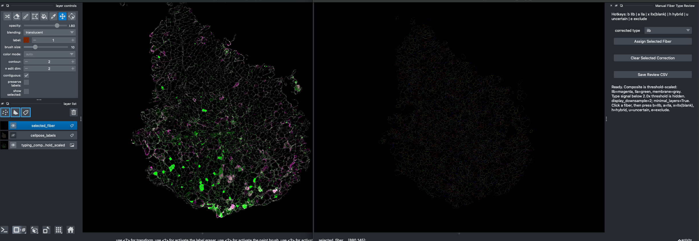
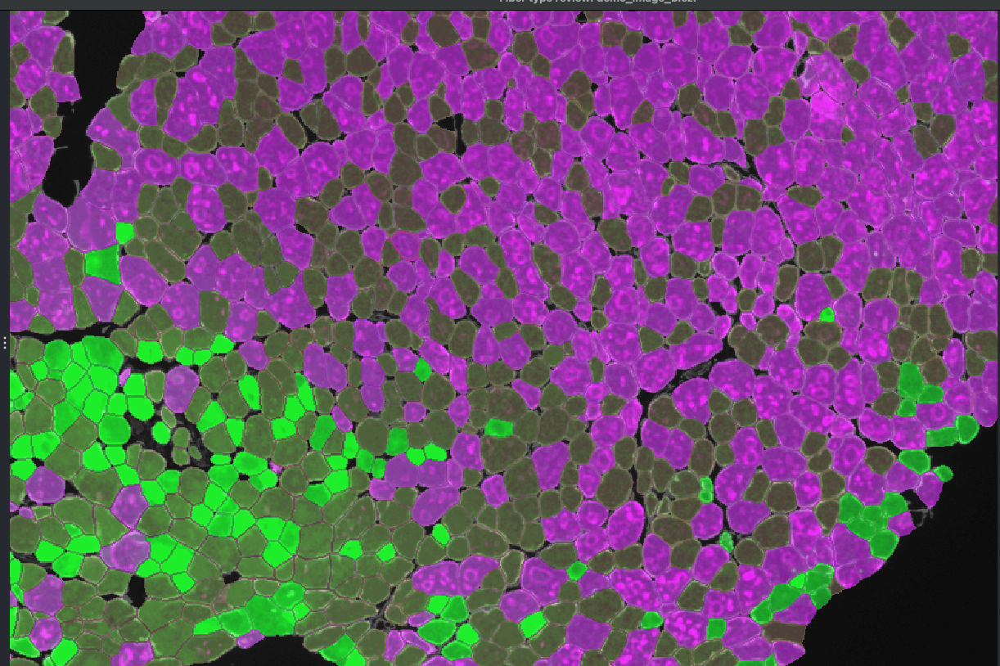
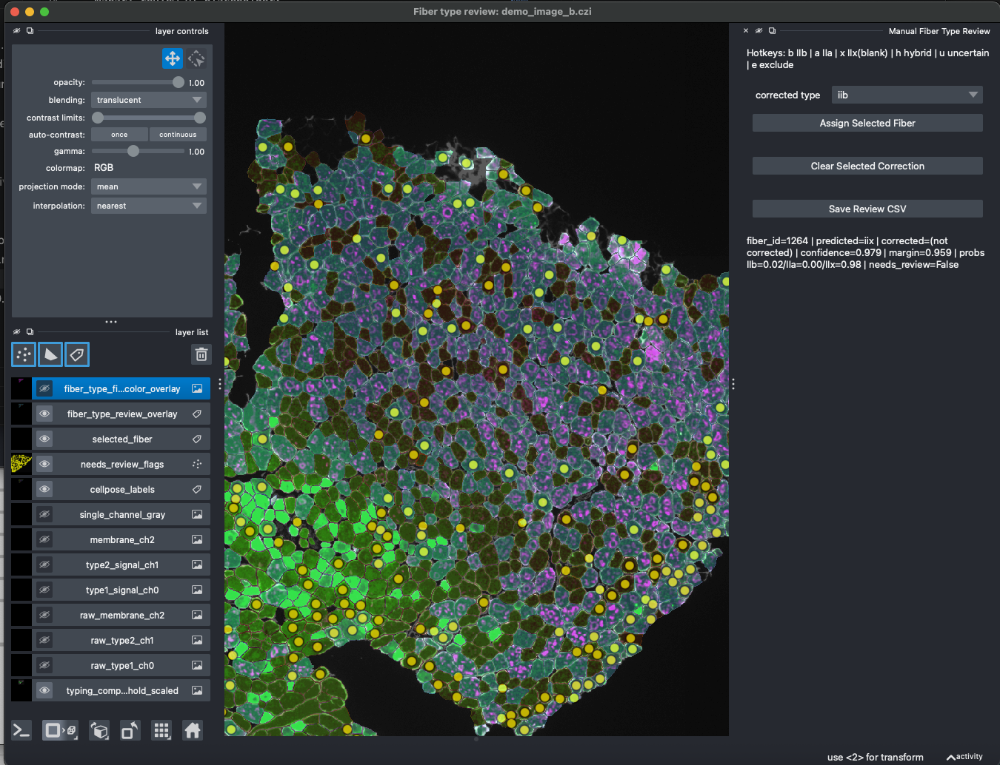
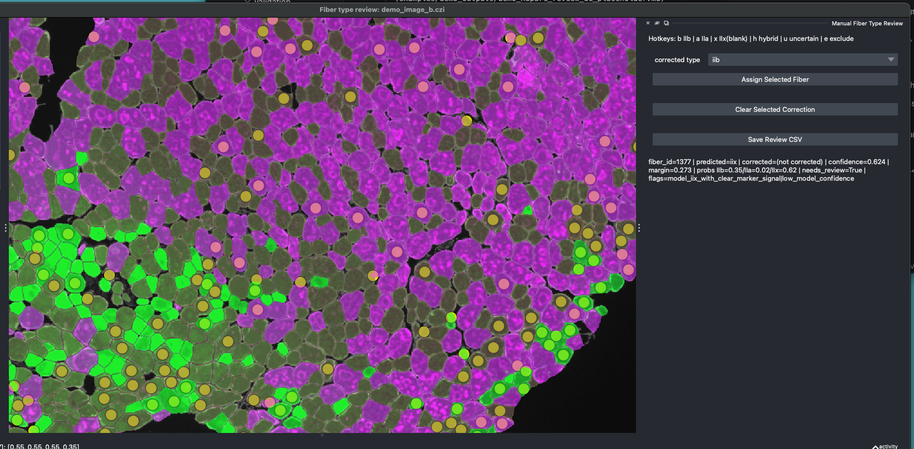
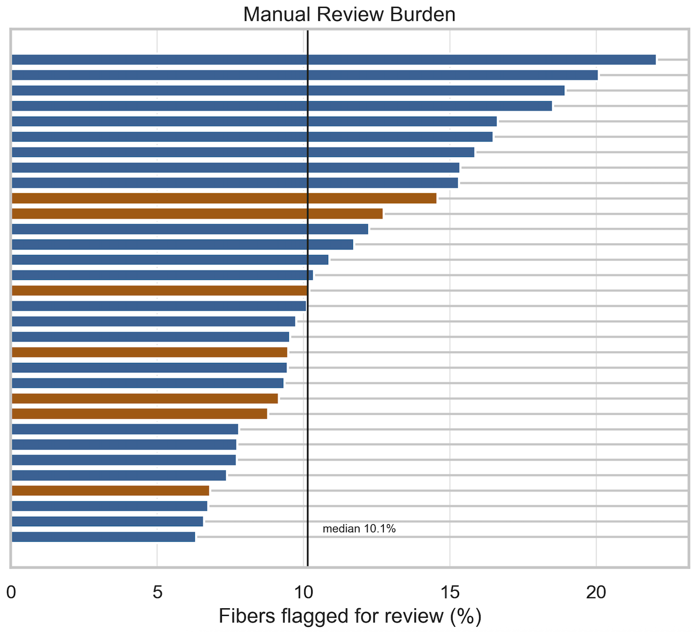

# FiberTypeQC v0.3.0.dev0

**Muscle fiber segmentation, type classification, and interactive review for immunofluorescence histology images.**

This pipeline processes multi-channel immunofluorescence (IF) microscopy images of muscle tissue to:
1. **Segment** muscle fibers from a membrane/border channel (Cellpose)
2. **Classify** fiber types with a panel-specific model (default: Type I, IIa, IIb, and residual
   IIx on four-marker QUAD panels)
3. **QC** every image and fiber, and **review** flagged results interactively (Napari)
4. **Finalize** review decisions into analysis-ready tables without altering predictions
5. **Report** image, mouse, and cohort results with a self-contained HTML report

## Demo

The latest published release is v0.2.0. This development branch is v0.3.0.dev0 and retains the
review-assisted frozen baseline workflow while candidate-model evaluation remains experimental.
FiberTypeQC is not positioned as a final validated MyoSight replacement.

Demo assets:

Segmentation view (raw membrane with labels):



Fiber-type overlay view:



Napari review UI (overview):



Napari review UI (zoomed, confidence/probability context):



Batch/validation summary figure:



The two Napari screenshots intentionally show both full-context review overlay and a zoomed inspection
view for per-fiber confidence/probability interpretation.

Demo CSV outputs and provenance notes are documented in
[docs/demo_manifest.md](docs/demo_manifest.md).

Run the public-safe deterministic reference workflow and validate its outputs:

```bash
uv run python -m scripts.run_reference
```

This reference uses a supplied synthetic label mask so its golden tables do not depend on Cellpose
device behavior. It validates pipeline, frozen-model, versioned QC, review-merge, schema, and digest
mechanics; it is not biological validation. See [docs/output_schema.md](docs/output_schema.md) for
the stable QC codes and next-action contract.

---

## Quick Start

### 1. Environment Setup

```bash
# Clone/navigate to this repo
cd /path/to/fibertypeqc

# Install dependencies (requires uv)
uv sync

# Or activate existing environment
source .venv/bin/activate
```

For detailed setup instructions, see [README_uv_setup.md](README_uv_setup.md).

### 1.1 Tests

Fast synthetic/default test path:

```bash
uv run python -m pytest -m "not integration"
```

Optional integration path:

```bash
uv run python -m pytest -m integration
```

## End-to-End Workflow

The supported release path, from images to a cohort report. Each step reads the previous step's
files and writes new ones; predictions are never modified.

```bash
# Run every command from the repository root (the folder containing pyproject.toml).
# 0. Once per machine: environment and the private model location
uv sync
export FIBERTYPEQC_MODEL_ROOT=/path/to/private/models   # contains quad_four_class_rf_v1.joblib
#    (or skip the export and pass --model /path/to/quad_four_class_rf_v1.joblib to run_batch)

# 1. Segment, type, and QC every image (default model: quad_four_class_rf_v1).
#    Add --split-czi-scenes when CZIs hold several Zeiss scenes; each scene becomes a section
#    (<image>_section-NN). Tissue pieces imaged within one scene stay together.
uv run python -m scripts.run_batch \
  --input-dir images/ --panel-config my_panel.yaml --output-dir runs/batch1

# 2. Build a review project from the batch and a sample sheet
#    (CSV: image_id, mouse_id, raw_image_path[, section_id][, condition columns...])
uv run python -m scripts.make_review_project \
  --batch-dir runs/batch1 --sample-sheet samples.csv \
  --panel-config my_panel.yaml --project-dir review/batch1

# 3. Project QC and section selection
uv run python -m scripts.generate_review_qc --project review/batch1/project.yaml

# 4. Review in Napari (GUI); decisions autosave under review/batch1/review/
uv run python -m scripts.review_project_napari \
  --project review/batch1/project.yaml --reviewer YOUR_NAME --display-downsample 2

# 5. Finalize review decisions into analysis-ready tables
uv run python -m scripts.finalize_review_project \
  --project review/batch1/project.yaml --output-dir review/batch1/final

# 6. Image/mouse/cohort tables and the HTML report
uv run python -m scripts.summarize_results \
  --final-dir review/batch1/final --project review/batch1/project.yaml \
  --output-dir review/batch1/results
```

`run_batch` checks the model, panel, and inputs before processing and stops with one message if
something is missing. Steps 3–6 are fast and can be re-run at any time; step 5 refuses to apply review decisions to
masks or tables that changed after review began. Keep large run outputs on storage with room for
them (label masks are about the size of the raw images). Details for each step follow below and in
[README_review_workflow.md](README_review_workflow.md).

### Single-Image Pipeline (Historical Three-Class Example)

The **v0 frozen command** is the production-validated baseline for consistent results.

```bash
uv run python -m scripts.run_pipeline \
  --input path/to/image.czi \
  --output-dir outputs/v0_run/image_name \
  --iib-channel 0 \
  --iia-channel 1 \
  --membrane-channel 2 \
  --typing-preprocess tile_subtract \
  --typing-tile-size 256 \
  --typing-erode-px 2 \
  --classifier-path data/models/rebaseline_tile_v2_p75p90_iib_iia_iix.joblib
```

**Parameters:**
- `--input`: Path to .czi or .tiff image
- `--output-dir`: Where to save this image's results (`run_batch` creates one subdirectory per image)
- `--iib-channel`: Channel for IIb marker signal (default: 0)
- `--iia-channel`: Channel for IIa marker signal (default: 1)
- `--membrane-channel`: Structural membrane/laminin channel for segmentation (default: 2)
- `--classifier-path`: Path to sklearn classifier (.joblib)
- `run_batch` additionally applies `--model-confidence-threshold 0.55 --model-margin-threshold 0.15`
  and `--downsample-factor 2`; the single-image command above uses the `run_pipeline` defaults for
  those options. Print the full frozen set with `uv run python -m scripts.run_batch --show-v0-params`.
- `--sensitivity` and `--mixed-strictness` derive several typing parameters (`--quantile`,
  `--typing-bg-sigma`, `--typing-smooth-sigma`, `--min-coverage`, and review thresholds). Values
  passed explicitly for those options are overridden; the run prints a warning and records a
  `preflight.typing_flags_overridden` QC check listing the effective values.

The frozen baseline channel schema is intentionally narrow: IIx is inferred as the unstained class
relative to the IIb and IIa channels. Panel-aware configuration is available as an explicit opt-in,
but does not expand the biological claims made by the frozen default model.
Legacy aliases `--type1-channel` and `--type2-channel` are still accepted for backward
compatibility. See [docs/quickstart.md](docs/quickstart.md), [docs/panel_schema.md](docs/panel_schema.md),
and [data/models/model_card.md](data/models/model_card.md).

Advanced/model-development note:

- `--export-diagnostics` is available for optional feature/model debugging output.
- It is off by default.
- It writes a separate diagnostics CSV and does not expand the stable `*_fibers.csv` schema.

Panel-aware opt-ins are operational: semantic Type I/direct IIx/eMHC measurements, isolated
candidate-model prediction sidecars, DAPI nuclear segmentation/association, compatible label-cache
reuse, and matching review overlays. They do not promote automatic regeneration or nuclear
pathology calls. See [docs/panel_schema.md](docs/panel_schema.md),
[docs/output_schema.md](docs/output_schema.md), and
[README_review_workflow.md](README_review_workflow.md).

### 3. Batch Processing

Process multiple images in a directory. By default `run_batch` uses the registry's default model,
the four-class QUAD model `quad_four_class_rf_v1` (see
[its model card](docs/model_cards/quad_four_class_rf_v1.md)), which needs a panel config and the
private model root:

```bash
export FIBERTYPEQC_MODEL_ROOT=/path/to/private/models
uv run python -m scripts.run_batch \
  --input-dir /path/to/images \
  --panel-config my_quad_panel.yaml \
  --output-dir outputs/quad_batch

# Historical three-class run (IIb/IIa/laminin panel, legacy channel defaults):
uv run python -m scripts.run_batch --input-dir /path/to/images \
  --model rebaseline_tile_v2_p75p90_iib_iia_iix
```

The batch runner:
- Finds all `.czi`, `.tif`, `.tiff` files in the input directory
- Applies v0 pipeline to each
- Collects results in `batch_summary.csv` with fiber counts and status
- Logs failures (including unreadable multi-scene CZIs) without crashing the batch
- Creates organized per-image output folders whose files are named by image ID
  (`--image-id`), so result bundles and reports reference the files that exist
- Verifies the frozen model's digest and panel requirements through its model manifest; pass
  `--model-manifest` to verify a custom `--classifier-path`
- Refuses manifests with duplicate image IDs

With `--model rebaseline_tile_v2_p75p90_iib_iia_iix` (or `--classifier-path`), `scripts.run_batch`
reproduces the frozen v0 alpha behavior. If you pass `--channel-config` or explicit channel
overrides in that mode, the batch run will log that it is no longer a strict frozen-baseline run.

To see v0 parameters:
```bash
uv run python -m scripts.run_batch --show-v0-params
```

---

## Workflow

### Pipeline Output

Each image produces:

```
outputs/v0_run/image_name/
├── image_name_cellpose_labels.tif          # Segmentation masks
├── image_name_fibers.csv                   # Feature table (rows=fibers)
├── image_name_feature_diagnostics.csv      # Optional diagnostics table (advanced/debugging)
├── image_name_summary.csv                  # Image-level statistics and QC flags
├── image_name_run.json                     # Run manifest: parameters, versions, fingerprints
├── image_name_preflight_qc.json            # Input/configuration QC
├── image_name_postrun_qc.json              # Output QC checks and next action
├── image_name_result_bundle.json           # Portable index of retained result artifacts
└── image_name_result_report.html           # Self-contained results/QC report and next action

The review step writes `image_name_fibers_manual_review.csv`; merging writes
`image_name_fibers_final.csv`.
```

Column definitions are documented in [docs/output_schema.md](docs/output_schema.md). External
analysis and visualization tools should start from the portable
[result-bundle contract](docs/result_bundle_schema.md).

### Interactive Review

Review and correct classifications in Napari:

```bash
uv run python -m scripts.review_labels_napari \
  --image path/to/image.czi \
  --labels outputs/v0_run/image_name/image_name_cellpose_labels.tif \
  --fibers outputs/v0_run/image_name/image_name_fibers.csv \
  --output outputs/v0_run/image_name/image_name_fibers_manual_review.csv
```

See [README_review_workflow.md](README_review_workflow.md) for detailed review instructions.

### Finalize Reviewed Results

Turn a reviewed project into analysis-ready tables. Finalization reads the predictions, label
masks, and saved review state, and writes new files; `*_fibers.csv` is never modified.

```bash
uv run python -m scripts.finalize_review_project \
  --project project.yaml \
  --output-dir final/
# Decisions from the per-image reviewer can be imported:
#   --legacy-review IMAGE_ID=path/to/IMAGE_ID_fibers_manual_review.csv
```

Each fiber keeps every model column (call, probabilities, confidence, margin) and gains
`final_type` and `value_source` (`predicted`, `reviewed`, `excluded`, or `unresolved`), with the
exclusion reason, reviewer, and decision time. Rules:

- exclusions win: image/section (domain status or `qc/section_selection.csv`), then drawn regions
  (by fiber centroid), then fiber decisions; otherwise the reviewer's decision, otherwise the
  prediction;
- fibers flagged for review but not reviewed keep the model call and are counted;
- unresolved fibers have no final type and are reported separately;
- named analysis ROIs tag each fiber (`roi_name`); fibers outside drawn ROIs are excluded;
- finalization refuses an image whose label mask or fiber table changed since review began, or
  whose reviewed decisions no longer match the model calls.

Outputs: `<image_id>_fibers_finalized.csv`, `final_fiber_table.csv`, and
`finalization_manifest.json` (input digests, versions, policies, and counts). See
[docs/output_schema.md](docs/output_schema.md).

`scripts.merge_reviewed_labels` (per-image merge of the legacy review CSV) still works but is
deprecated in favor of finalization.

### Results Tables and Cohort Report

```bash
uv run python -m scripts.summarize_results \
  --final-dir final/ --project project.yaml --output-dir results/
```

Writes `image_summary.csv`, `mouse_summary.csv`, `roi_summary.csv` (when analysis ROIs exist),
`cohort_summary.csv` (grouped by the project's per-image `condition` fields), a
`results_manifest.json`, and a self-contained `cohort_report.html`. The CSVs are the source of
truth; the report is generated only from them. Definitions:

- finalized composition = final types over resolved fibers (unresolved fibers are counted
  separately, not in the denominator); predicted composition = model calls over the same analysis
  fibers, so the report shows what review changed;
- mouse level pools fibers across sections; cohort level treats the mouse as the unit
  (mean ± SD of mouse-level proportions).

---

## Model Selection

Fiber-type models do not generalize across channel configurations, so each model declares the
panel it supports and the pipeline refuses a mismatched panel. Select a registered model by ID:

```bash
export FIBERTYPEQC_MODEL_ROOT=/path/to/private/models   # only for privately distributed models
# --model also accepts a path to a registered model file; it is identified by its SHA-256.
uv run python -m scripts.run_pipeline --input image.tif --output-dir out \
  --panel-config my_panel.yaml --model quad_four_class_rf_v1
```

| Model ID | Panel | Classes | Artifact |
|---|---|---|---|
| `quad_four_class_rf_v1` | laminin, Type I, IIa, IIb | I, IIa, IIb, IIx (residual) | private; resolved from `FIBERTYPEQC_MODEL_ROOT` and verified by digest |
| `synthetic_four_class_reference_v1` | laminin, Type I, IIa, IIb | I, IIa, IIb, IIx | tracked; synthetic test fixture only |
| `rebaseline_tile_v2_p75p90_iib_iia_iix` | laminin, IIa, IIb | IIa, IIb, IIx (residual) | tracked; retired historical baseline (`scripts.run_batch` default until the release switch) |

The registry is `manifests/model_registry.v1.yaml`. A model manifest may pin its
feature-extraction settings (`feature_extraction`); the pipeline then computes features exactly as
in training, does not apply the `--sensitivity` profile, and refuses typing flags that would change
them. See [data/models/model_card.md](data/models/model_card.md) for the historical baseline.

---

## Code Structure

```
fibertypeqc/                     # Public package namespace
├── io.py                        # I/O helpers
├── preprocess.py                # Membrane preprocessing helpers
├── segment.py                   # Cellpose segmentation helpers
├── quantify.py                  # Feature extraction + type classification
├── review.py                    # Review/merge helpers
├── models.py                    # Model defaults
└── metrics.py                   # Confidence/entropy/soft composition helpers

scripts/                         # Public command wrappers
├── run_pipeline.py              # Main pipeline entry point
├── run_batch.py                 # Batch runner (v0 frozen)
├── review_labels_napari.py      # Interactive Napari review UI
└── merge_reviewed_labels.py     # Combine predictions + manual corrections

validation/                      # Optional MyoSight/validation utilities

analysis/                        # Private-data-dependent case studies/placeholders

data/models/                     # Frozen baseline classifier

src/                             # Supported pipeline and review implementation

research/                        # Research/study tooling; not part of the release surface

tests/                           # Basic synthetic unit tests
```

---

## Quality Control

The pipeline includes automatic QC flags:

- **Low fiber count** (< 300 fibers)
- **High unknown rate** (> 35%)
- **Aberrant fiber sizes** (median area outside 200–15,000 px²)
- **Suspicious type correlation** (inter-type correlation > 0.92)

See `--qc-*` parameters in `run_pipeline.py` for customization.

---

## Requirements

- Python 3.11 (pinned by `pyproject.toml` and `uv.lock`)
- `uv` package manager
- macOS/Linux (GPU optional but recommended for Cellpose)

Key dependencies:
- `cellpose` – Fiber segmentation
- `scikit-learn` – Classification
- `napari` – Interactive review UI
- `pandas`, `numpy`, `scipy`, `scikit-image`

---

## Troubleshooting

### Image fails to load
- Check file format (.czi, .tif/.tiff supported)
- Multi-scene CZIs (several sections on one slide) are not read implicitly: split them with
  `run_batch --split-czi-scenes` or `python -m src.split_czi_scenes --input FILE --output-dir DIR`
- Z/T stacks must be projected or split into single-plane multichannel images first; TIFFs without
  channel metadata need ImageJ axes such as `CYX` when the channel count is ambiguous
- Verify file is not corrupted: `python -c "import czifile; czifile.CziFile('image.czi')"`

### Out of memory
- Reduce `--crop-ds` (preprocessing downsample, default: 8)
- Enable CPU-only mode: `--cpu`

### Low segmentation quality
- Check membrane channel is correct (`--membrane-channel`)
- Try `--diameter 25` or `--diameter 40` (default: 30)
- Consider preprocessing with `--cellpose-normalize`

### Classification errors
- Verify type marker channels are correct (`--iib-channel`, `--iia-channel`)
- Review confidence flags in `*_weak_labels.csv`
- Use a model whose panel matches your channel configuration

For detailed validation metrics, see [docs/validation_summary.md](docs/validation_summary.md)
and the scripts under `validation/`.

---

## Development

To extend or modify the pipeline:

1. **New preprocessing**: Add to `src/preprocess_membrane.py`
2. **New classifiers**: Register them with a model manifest; models trained on private data stay
   out of Git (see [ROADMAP.md](ROADMAP.md) and [docs/model_registry.md](docs/model_registry.md))
3. **Custom parameters**: Create preset configs in `run_batch.py`
4. **Unit tests**: Run `uv run python -m pytest`

---

## Lab Notes

This pipeline was developed initially for internal lab workflows and now maintained as a
public alpha tool. Primary applications:
- MDX (dystrophic) vs. WT (control) comparison studies
- Multi-mouse cohorts with single/multi-section imaging
- Semi-automated validation workflow

Validation and workflow documentation is available under `docs/` and `validation/`.

---

## License

MIT License. See [LICENSE](LICENSE).

---

## Contact

For questions, bug reports, or feature requests, open an issue in this repository.
