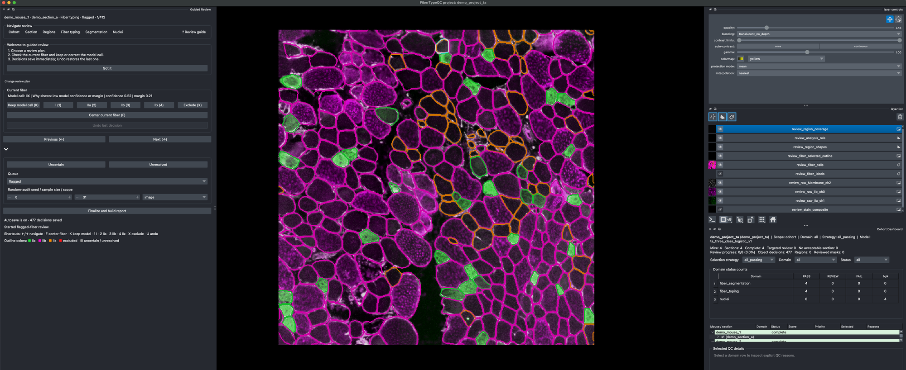

# Demo: four cropped fields, start to report

A small worked example of the whole workflow: segment and type four images, review flagged fibers
in napari, finalize, and open the cohort report. It takes a few minutes on a laptop.

The data are four cropped fields (1024 × 1024 px) from tibialis anterior sections of mdx mice, two
at 1 month and two at 12 months, stained for Type IIb, Type IIa, and laminin. Type IIx is inferred
from the absence of IIa and IIb signal. The demo illustrates the software; its numbers are not
study results, and the model has not been validated on a random hold-out sample
([model card](model_cards/ta_three_class_logistic_v1.md)).

## 1. Get the demo files

From the [releases page](https://github.com/jrconner16/fibertypeqc/releases) download
`fibertypeqc_demo.zip` and `ta_three_class_logistic_v1.joblib`. Unzip, and put the model file
inside the unzipped folder:

```text
fibertypeqc_demo/
  ta_three_class_logistic_v1.joblib   # the model you downloaded
  images/                             # demo_section_a..d.tif
  demo_project/                       # ready to run
  demo_project_completed/             # already run, reviewed, and finalized
```

`demo_project/fibertypeqc_project.yaml` already points at the images, the three-marker panel, and
the model file, and `samples.csv` already assigns each image to a mouse and an age group.

## 2. Run

From the FiberTypeQC repository (after `uv sync --frozen`):

```bash
uv run python -m fibertypeqc status  path/to/fibertypeqc_demo/demo_project
uv run python -m fibertypeqc run     path/to/fibertypeqc_demo/demo_project
uv run python -m fibertypeqc prepare path/to/fibertypeqc_demo/demo_project
```

`run` segments fibers with Cellpose and types them; `prepare` computes QC and builds the review
project. `status` tells you the next command at any point.

Check your run against the reference that ships with the demo:

```bash
uv run python -m fibertypeqc snapshot path/to/fibertypeqc_demo/demo_project --check
```

Identical masks must give identical fiber calls. If Cellpose segments slightly differently on your
machine, the check falls back to comparing fiber counts and class proportions within a tolerance.

## 3. Review

```bash
uv run python -m fibertypeqc review path/to/fibertypeqc_demo/demo_project
```

Choose **Review flagged fibers**. Each fiber is outlined in the color of its current call
(IIa green, IIb magenta, IIx orange), over the raw stain channels. Keys: `K` keep the model call,
`2`/`3`/`4` = IIa/IIb/IIx, `X` exclude, Left/Right to move, `U` undo. Decisions save as you go.



*The review workspace on `demo_section_a`. Panel layout may differ slightly between versions.*

Fibers cut off by the image edge are not queued: you cannot judge a fiber you cannot see whole.
Because these are cropped fields, the demo project also sets `exclude_image_border_fibers: true`,
which leaves those fibers out of the results (off by default for whole sections).

## 4. Finalize and read the report

Click **Finalize and build report** in the Guided Review dock, or run:

```bash
uv run python -m fibertypeqc finalize path/to/fibertypeqc_demo/demo_project
```

This writes finalized fiber tables to `final/`, summary tables to `results/`, and
`results/cohort_report.html`. Model calls are never overwritten: each fiber keeps its prediction
beside `final_type` and `value_source` (`predicted`, `reviewed`, `excluded`, `unresolved`).

## What a finished project looks like

`demo_project_completed/` is the same project after an example review of the flagged fibers
(477 decisions). Open `demo_project_completed/results/cohort_report.html`, or load the review to
see the decisions:

```bash
uv run python -m fibertypeqc review path/to/fibertypeqc_demo/demo_project_completed
```

Its mouse-level summary (percent of resolved fibers, IIb / IIa / IIx):

| Mouse | Age | Fibers | Excluded | Reviewed | Model calls | After review |
|---|---|---|---|---|---|---|
| demo_mouse_1 | 1 month | 334 | 61 | 102 | 64 / 11 / 26 | 72 / 12 / 16 |
| demo_mouse_2 | 1 month | 531 | 72 | 183 | 46 / 9 / 45 | 51 / 11 / 38 |
| demo_mouse_3 | 12 months | 550 | 70 | 55 | 74 / 1 / 26 | 72 / 1 / 26 |
| demo_mouse_4 | 12 months | 560 | 55 | 66 | 45 / 14 / 42 | 44 / 14 / 42 |

Nearly all exclusions are fibers cut off by the crop edge. Your own review will differ where your
judgment does; the IIb/IIx split in particular depends on the absence of stain and is partly
subjective.
